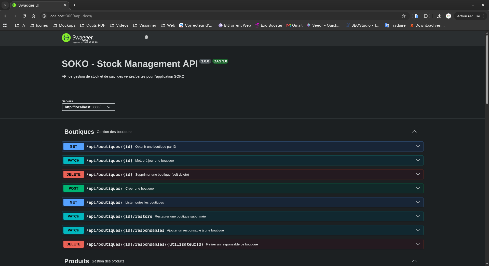

# SOKO - Stock Management App | Backend

[](https://nodejs.org)
[](https://expressjs.com)
[](https://mongodb.com)
[](https://www.better-auth.com)
[](https://swagger.io)
[](https://arcjet.com)
[](LICENSE)

API REST de gestion de stock et de ventes développée avec **Node.js**, **Express** et **MongoDB**.

SOKO Backend permet aux commerces et boutiques de gérer efficacement leurs produits, leurs stocks, leurs ventes et leurs pertes tout en assurant une authentification sécurisée grâce à Better Auth.

---

## Fonctionnalités

### Authentification et sécurité

* Authentification avec Better Auth
* Gestion des sessions via cookies HTTP Only
* Inscription utilisateur
* Connexion utilisateur
* Déconnexion sécurisée
* Vérification d'adresse email
* Réinitialisation de mot de passe
* Gestion des rôles et permissions
* Protection des routes privées
* Protection contre les abus avec Arcjet
* Sécurisation des en-têtes HTTP avec Helmet

### Gestion des utilisateurs

* Consultation de son profil
* Modification de son profil (nom, prénom, téléphone, photo)
* Administration des utilisateurs (rôles, activation/désactivation)
* Pagination sur la liste des utilisateurs
* Trois rôles : administrateur, responsable, secrétaire

### Gestion des boutiques

* Création de boutiques
* Consultation des boutiques
* Modification des informations
* Suppression logique
* Restauration des boutiques supprimées
* Affectation de responsables (admin)
* Retrait de responsables (admin)
* Affectation de secrétaires (responsable ou admin)
* Retrait de secrétaires (responsable ou admin)

### Gestion des produits

* Création de produits
* Consultation des produits
* Recherche de produits
* Modification des informations
* Suppression logique

### Gestion des stocks

* Création de stock
* Consultation des stocks
* Ajout de quantité
* Retrait de quantité
* Suivi des mouvements de stock
* Suppression logique
* Restauration des stocks supprimés

### Gestion des ventes

* Enregistrement des ventes
* Consultation de l'historique
* Calcul automatique des montants
* Mise à jour automatique des stocks
* Suppression logique

### Gestion des pertes

* Déclaration des pertes
* Consultation de l'historique
* Justification des pertes
* Mise à jour automatique des stocks
* Suppression logique

### Pagination

* Pagination réutilisable via middleware
* Paramètres `page` et `limit`
* Métadonnées de pagination
* Réponses standardisées

### Documentation

* Documentation Swagger/OpenAPI
* Test des endpoints directement depuis Swagger UI

---

## Architecture

Le projet suit une architecture inspirée du modèle MVC avec une séparation claire des responsabilités.

```text
SOKO-Backend
│
├── config/
│   ├── arcjet.js
│   ├── db.js
│   └── email.js
│
├── controllers/
│
├── services/
│
├── middlewares/
│   ├── auth.middleware.js
│   ├── error.middleware.js
│   ├── pagination.middleware.js
│   ├── requireRole.middleware.js
│   ├── responsableouadmin.middleware.js
│   └── verifiedemail.middleware.js
│
├── models/
│
├── routes/
│
├── utils/
│   └── pagination.util.js
│
├── errors/
│
├── auth.js
├── app.js
├── swagger-output.json
└── package.json
```

### Description des dossiers

| Dossier     | Description                                             |
| ----------- | ------------------------------------------------------- |
| config      | Configuration de la base de données, sécurité et emails |
| controllers | Gestion des requêtes HTTP                               |
| services    | Logique métier                                          |
| middlewares | Authentification, pagination et validation              |
| models      | Schémas MongoDB                                         |
| routes      | Définition des routes                                   |
| utils       | Fonctions utilitaires                                   |
| errors      | Gestion centralisée des erreurs                         |

---

## Technologies utilisées

| Catégorie        | Technologie    |
| ---------------- | -------------- |
| Runtime          | Node.js        |
| Framework        | Express.js     |
| Base de données  | MongoDB        |
| ODM              | Mongoose       |
| Authentification | Better Auth    |
| Sécurité         | Arcjet, Helmet |
| Emails           | Resend         |
| Documentation    | Swagger UI     |
| Validation       | Validator.js   |

---

## Installation

### 1. Cloner le projet

```bash
git clone https://github.com/vanouofc/SOKO-Backend.git
cd SOKO-Backend
```

### 2. Installer les dépendances

```bash
npm install
```

### 3. Configurer les variables d'environnement

Créer un fichier `.env` à la racine du projet.

```env
PORT=3000

DB_URL=

BETTER_AUTH_SECRET=
BETTER_AUTH_URL=http://localhost:3000

RESEND_API_KEY=
FROM=

ARCJET_KEY=
ARCJET_ENV=development
```

---

## Lancement du projet

### Développement

```bash
npm start
```

Le serveur sera accessible sur :

```text
http://localhost:3000
```

---

## Authentification

Le projet utilise Better Auth pour gérer les utilisateurs et les sessions.

### Fonctionnement

1. L'utilisateur crée un compte.
2. Un email de vérification est envoyé.
3. L'utilisateur valide son adresse email.
4. Une session sécurisée est créée lors de la connexion.
5. Les routes protégées vérifient automatiquement la session.
6. La déconnexion invalide la session côté serveur.

### Routes Better Auth

```http
POST /api/auth/sign-up/email
POST /api/auth/sign-in/email
POST /api/auth/sign-out

GET  /api/auth/get-session

POST /api/auth/forget-password
POST /api/auth/reset-password

POST /api/auth/send-verification-email
POST /api/auth/verify-email
```

### Exemple côté Frontend

```javascript
const response = await fetch(
  "http://localhost:3000/api/auth/get-session",
  {
    credentials: "include"
  }
);

const session = await response.json();
```

> Les cookies de session doivent être envoyés avec `credentials: "include"`.

---

## Pagination

L'API prend en charge la pagination afin d'améliorer les performances et de limiter la quantité de données retournées.

### Paramètres disponibles

| Paramètre | Description                | Valeur par défaut |
| --------- | -------------------------- | ----------------- |
| page      | Numéro de page             | 1                 |
| limit     | Nombre d'éléments par page | 20                |

### Exemples

```http
GET /api/boutiques?page=1&limit=20
```

```http
GET /api/produits?page=2&limit=10
```

```http
GET /api/stocks?page=3&limit=50
```

### Exemple de réponse

```json
{
  "data": [
    {
      "_id": "6878d8f8f3e9b6f7fcbf1234",
      "nom": "Boutique Centre"
    }
  ],
  "pagination": {
    "total": 125,
    "totalPages": 7,
    "currentPage": 1,
    "limit": 20,
    "hasNextPage": true,
    "hasPrevPage": false
  }
}
```

---

## Documentation Swagger

Une documentation Swagger interactive est disponible après le démarrage du serveur.

```text
http://localhost:3000/api-docs
```



Swagger permet :

* Visualiser les endpoints par catégorie (Boutiques, Produits, Stocks, Ventes, Pertes, Utilisateurs)
* Tester les requêtes directement depuis le navigateur
* Consulter les schémas de données
* Vérifier les réponses attendues

---

## Routes principales

### Boutiques

```http
GET    /api/boutiques
GET    /api/boutiques/:id
POST   /api/boutiques
PATCH  /api/boutiques/:id
PATCH  /api/boutiques/:id/restore
PATCH  /api/boutiques/:id/responsables
DELETE /api/boutiques/:id/responsables/:utilisateurId
PATCH  /api/boutiques/:id/secretaires
DELETE /api/boutiques/:id/secretaires/:utilisateurId
DELETE /api/boutiques/:id
```

### Produits

```http
GET    /api/produits
GET    /api/produits/:id
POST   /api/produits
PATCH  /api/produits/:id
DELETE /api/produits/:id
```

### Stocks

```http
GET    /api/stocks
GET    /api/stocks/:id

POST   /api/stocks

PATCH  /api/stocks/:id
PATCH  /api/stocks/:id/add
PATCH  /api/stocks/:id/remove
PATCH  /api/stocks/:id/restore

DELETE /api/stocks/:id
```

### Ventes

```http
GET    /api/ventes
GET    /api/ventes/:id

POST   /api/ventes

PATCH  /api/ventes/:id

DELETE /api/ventes/:id
```

### Pertes

```http
GET    /api/pertes
GET    /api/pertes/:id

POST   /api/pertes

PATCH  /api/pertes/:id

DELETE /api/pertes/:id
```

### Utilisateurs

```http
GET    /api/utilisateurs/me
PATCH  /api/utilisateurs/me

GET    /api/utilisateurs
GET    /api/utilisateurs/:id

PATCH  /api/utilisateurs/:id/role
PATCH  /api/utilisateurs/:id/desactiver
PATCH  /api/utilisateurs/:id/reactiver
```

---

## Gestion des erreurs

L'application utilise une gestion centralisée des erreurs métier.

Exemple :

```json
{
  "success": false,
  "message": "La quantité demandée est supérieure au stock disponible."
}
```

---

## Sécurité

Les mécanismes de sécurité implémentés incluent :

* Better Auth
* Sessions sécurisées
* Cookies HTTP Only
* Vérification d'adresse email
* Arcjet
* Helmet
* Validation des données
* Gestion centralisée des erreurs

### Rôles et contrôle d'accès

| Rôle | Description |
| ---- | ----------- |
| `admin` | Accès complet : gestion des boutiques, produits, stocks, ventes, pertes et utilisateurs |
| `responsable` | Gestion de sa/ ses boutique(s) : produits, stocks, ventes, pertes, affectation de secrétaires |
| `secretaire` | Consultation seule : listes et détails des produits, stocks, ventes, pertes |

Les routes sont protégées par une chaîne de middlewares : `authMiddleware` → `requireVerifiedEmail` → `requireRole(...)` ou `requireResponsableOuAdmin`.

---

## Scripts disponibles

### Démarrer le serveur

```bash
npm start
```

### Générer la documentation Swagger

```bash
npm run swagger
```

---

## Roadmap

* Gestion des fournisseurs
* Gestion des clients
* Tableau de bord analytique
* Export PDF
* Export Excel
* Rapports financiers
* Notifications en temps réel
* Gestion multi-boutiques avancée

---

## Auteur

**TINGUEU NGUIFO Shivano**

GitHub : https://github.com/vanouofc

Portfolio : https://shivano.pages.dev

---

## Licence

Ce projet est distribué sous licence ISC.
